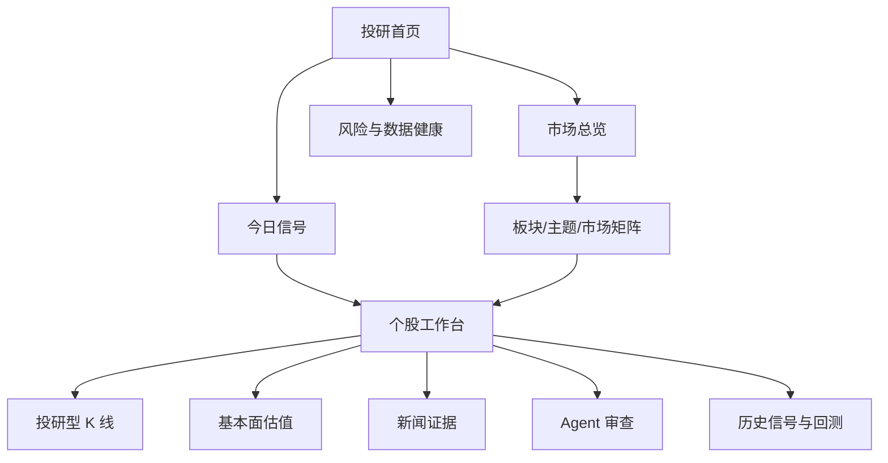
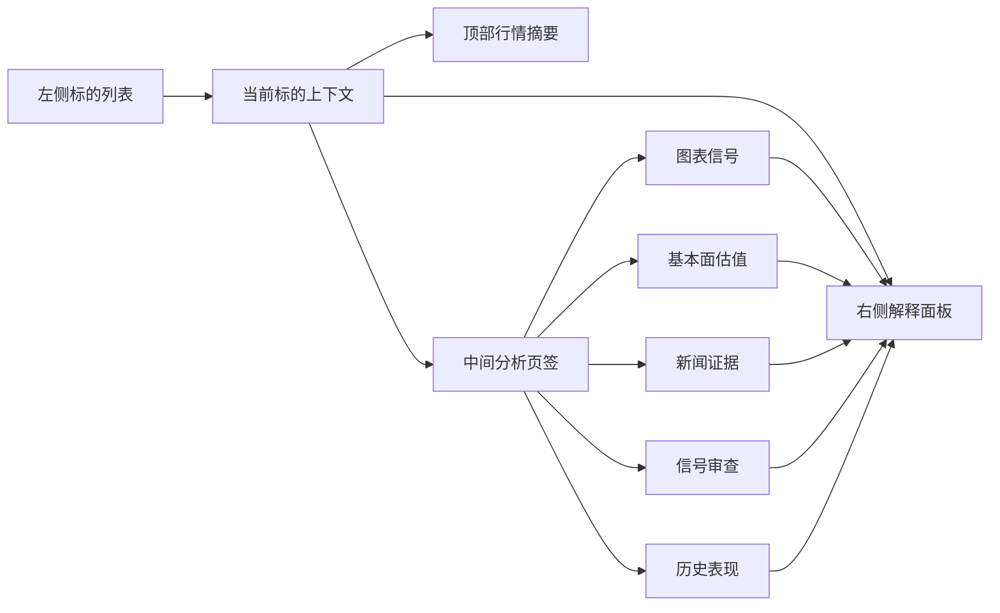

# 投研型 K 线与个股工作台整体优化设计

## 1. 背景与目标

当前 A/H 股投研工作台已经具备自选股、行情看板、今日信号、个股工作台、基本面估值、新闻证据、信号审查、历史信号、事件回测、策略调优和数据健康等能力。问题不在于功能缺失，而在于用户完成一次个股研究时，需要在多个页面之间切换，行情上下文、信号依据、基本面证据和风险审查容易被拆散。

富途牛牛值得学习的不是交易按钮或盘口能力，而是它对行情分析信息的组织方式：自选列表、K 线主图、右侧标的上下文和底部市场状态始终在线。用户可以围绕一个标的持续下钻，而不丢失当前价格、走势、指标、新闻和分析线索。

本设计的目标是把现有投研工作台从“功能集合”升级为“研究型行情工作台”，形成一条稳定主路径：

```text
投研首页 -> 市场总览/今日信号 -> 个股工作台 -> 投研型 K 线 -> 基本面/新闻/审查/回测验证
```

## 2. 产品定位

本项目继续保持 research/simulation 定位，不接真实交易接口，不展示交易按钮，不输出直接买卖指令。优化方向是把行情、规则信号、AI 审查、数据可信度和历史表现放到同一研究上下文中，让用户更快完成“发现、验证、复盘”。

设计原则：

- 以个股工作台作为核心入口，K 线作为默认主视图。
- 学习富途的信息密度和上下文保留方式，但避免券商终端式复杂交易控件。
- 所有结论必须能回到数据、信号、证据或审查记录。
- 缺失数据显式披露，不用 AI 伪造财务、行情或新闻证据。
- 文案使用“观察、信号、风险、审查、历史表现”，避免交易指令化表达。

## 3. 总体信息架构

这张图描述优化后的主导航关系。投研首页负责分发，市场总览和今日信号负责发现，个股工作台负责连续分析，专业页面提供审计、回测和配置能力。



## 4. 核心体验设计

### 4.1 投研首页

首页定位为“今日研究分发台”，不再只是功能入口集合。用户打开后应在 30 秒内知道今天市场是否值得看、哪些标的优先看、哪些风险必须处理。

建议模块：

- 市场状态：核心指数、强弱行业、涨跌结构、风险摘要。
- 今日机会：重点观察、新增观察、等待确认、风险升高、信号失效。
- 数据可信度：行情同步状态、因子覆盖率、财务数据缺口、质量问题数量。
- 操作入口：同步行情、扫描信号、打开个股、生成复盘。

### 4.2 市场总览

市场总览学习富途的“全局扫描 + 局部下钻”模式，但第一期不追求全市场覆盖，可以先基于自选池、指数、行业分类和已有信号数据实现。

建议模块：

- 指数卡片：A 股、港股、美股核心指数。
- 市场矩阵：行业、市场、信号方向和风险状态的热力展示。
- 排行榜：涨跌榜、成交额榜、信号榜、风险榜。
- 右侧上下文：选中指数、行业或主题的小 K 线、信号摘要和相关新闻。

### 4.3 个股工作台

个股工作台是本轮优化重点。建议采用三栏布局：

左侧为标的导航：

- 自选股。
- 今日信号。
- 最近查看。
- 风险升高标的。

中间为主分析区：

- 顶部固定标的摘要。
- 默认展示投研型 K 线。
- 页签切换：图表信号、基本面估值、新闻证据、信号审查、历史表现。

右侧为当前标的上下文：

- 最新价、涨跌幅、成交量、20 日/60 日收益。
- 当前主信号、信号等级、评分。
- 数据可信度。
- Agent 审查摘要。
- 风险旗标。
- 下一步建议。

这张图描述个股工作台内的信息流。用户从左侧选择标的后，中间和右侧同时更新，页签切换不会丢失当前标的上下文。



## 5. 投研型 K 线设计

K 线图应成为个股工作台的主入口。它不是普通行情图，也不是交易终端图，而是“行情 + 信号 + 证据 + 审查 + 回测”的汇聚层。

### 5.1 行情层

- 周期切换：日线、周线、月线。
- 区间切换：1 月、3 月、6 月、1 年、3 年。
- 主图：K 线、均线、价格坐标、当前价线。
- 副图：成交量、MACD、RSI、相对强弱、信号评分。
- 十字光标：展示日期、开高低收、成交量、涨跌幅。

### 5.2 信号层

- 默认只展示信号点位，避免文字覆盖 K 线。
- hover 展示信号日期、周期落点、信号名称、方向、评分、入场参考价、20 日收益、最大不利波动。
- 点击信号后右侧解释面板固定展示信号详情。
- 信号点按方向区分：机会、风险、中性。
- 继续明确“周线趋势 + 日线执行”的策略口径，周期切换仅改变可视化聚合，不改变后端策略语义。

### 5.3 证据层

- 财报、公告、新闻冲击、Agent 审查、回测失败样本以事件点标记。
- 事件点默认轻量展示，hover 后显示标题、日期、来源和影响摘要。
- 点击事件可切到新闻证据、基本面估值或历史表现页签。

### 5.4 解释层

K 线图下方或右侧提供解释区：

- 当前信号为何触发。
- 哪些条件未满足。
- 当前最大风险是什么。
- 历史同类信号表现如何。
- 数据是否足够支持判断。

## 6. 基本面、新闻与审查联动

基本面估值页应从指标卡升级为“图表 + 表格 + 数据可信度”：

- 营收、净利润趋势。
- ROE、毛利率趋势。
- PE、PB 历史走势。
- 估值历史分位。
- 行业均值对比。
- 财务字段缺失披露。

新闻证据页应服务于信号验证，而不是做泛资讯流：

- 展示与当前信号、财报、风险相关的新闻和公告。
- 保留来源、时间、摘要和证据标签。
- 支持从 K 线事件点跳转。

Agent 审查应嵌入每个关键模块：

- K 线页解释信号触发逻辑。
- 基本面页解释估值和财务缺口。
- 新闻页解释信息影响。
- 历史表现页解释策略弱点。

## 7. 分阶段优化范围

| 阶段 | 目标 | 主要产物 |
| --- | --- | --- |
| Phase 1 | 强化 K 线体验 | 周期切换、hover、十字光标、信号解释 |
| Phase 2 | 个股工作台三栏化 | 左侧标的导航、中间主分析区、右侧上下文 |
| Phase 3 | 个股页签收敛 | 图表、基本面、新闻、审查、历史表现集中到一个工作台 |
| Phase 4 | 市场总览升级 | 指数卡片、市场矩阵、信号榜、风险榜 |
| Phase 5 | 基本面图表化 | 财务趋势、估值分位、行业对比 |
| Phase 6 | 证据链闭环 | 新闻、信号、审查、回测、复盘联动 |

第一期建议合并 Phase 1 和 Phase 2 的最小闭环：

- 增强投研型 K 线。
- 个股工作台采用三栏布局。
- 右侧固定标的上下文面板。
- 将图表信号、基本面估值、新闻证据、信号审查和历史表现作为个股页签。

## 8. 验收标准

- 用户从今日信号或市场总览进入个股后，可以不离开个股工作台完成主要研究。
- K 线图支持日线、周线、月线和常用区间切换。
- 信号点默认不遮挡 K 线，hover 或点击后展示完整解释。
- 右侧上下文随标的和选中信号同步更新。
- 基本面、新闻、审查、历史表现可以通过个股页签访问。
- 缺失数据、低可信数据和风控限制有明确提示。
- 前端生产构建通过。
- 不新增真实交易、下单、盘口逐笔或券商账户相关能力。

## 9. 风险与待确认问题

- K 线图当前使用 SVG 自研组件，后续指标和事件层增多后，需要关注性能和交互复杂度。
- 行业热力图、指数行情、新闻证据和机构数据都依赖数据源覆盖；没有授权或落库前不要做完整 UI 承诺。
- 右侧上下文面板需要统一 quote、factor、fundamentals、review、backtest 的数据口径，避免各页字段不一致。
- 是否引入成熟图表库需要单独评估；第一期建议继续沿用现有 SVG 组件，降低依赖风险。
