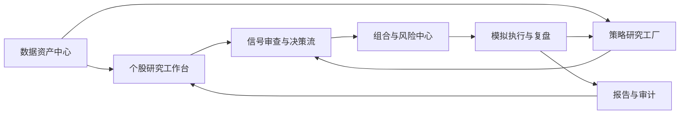
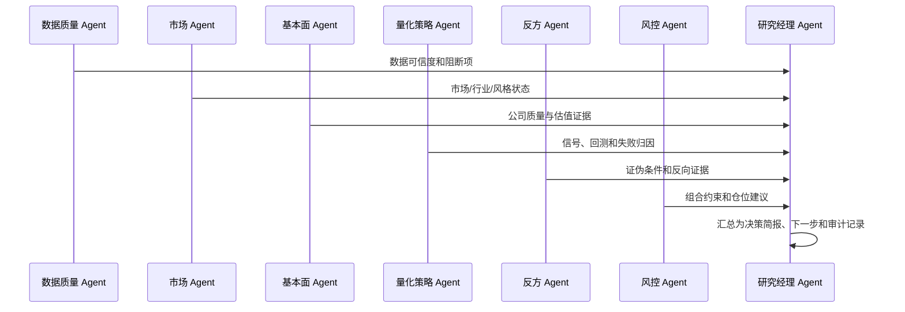

# 投研操作系统完整路线 Implementation Plan

> **For Claude:** REQUIRED SUB-SKILL: Use superpowers:executing-plans to implement this plan task-by-task.

**Goal:** 将现有 TradingAgents 投研工作台升级为以个股研究、策略验证、组合风控和复盘审计为闭环的专业投研操作系统。

**Architecture:** 以现有 FastAPI + React + SQLite 本地研究栈为底座，先统一数据资产、策略版本、信号决策、组合状态和审计事件的领域模型，再逐层补齐页面与工作流。系统保持 research/simulation 边界，不接真实交易接口，所有建议输出都必须带数据可信度、策略版本和风险披露。

**Tech Stack:** Python 3.12、FastAPI、SQLite、Pandas、AkShare/TuShare/Futu 可选数据源、React 18、Vite、TypeScript、本地 Markdown 报告、pytest、frontend `npm test`/`npm run build`。

---

## 1. 背景与定位

当前仓库已经具备投研平台雏形：

- 投研首页：`ResearchBriefPage` 汇总决策层、信号队列、风险和数据覆盖。
- 个股工作台 V2：`SymbolWorkspaceV2` 提供现状速览、图表与信号、基本面与催化剂、决策与复盘。
- 策略验证：已有 V2 多指标共振策略、专属回测、事件回测、组合回测和策略调优页面。
- 治理能力：已有数据健康、同步追踪、信号审查、Agent 复核、风险队列。

下一阶段不是新增一个孤立模块，而是把这些能力组织成一套完整的“投研操作系统”：

## 2. 产品原则

1. **证据先于结论**：每个结论都必须能追溯到数据源、策略版本、Agent 输出或人工记录。
2. **研究和模拟边界清晰**：不接真实下单；所有执行能力均为模拟、计划、复盘。
3. **单票服务组合**：个股建议必须经过组合风险、流动性、仓位和数据质量约束。
4. **策略必须可验证**：策略信号必须支持样本内/样本外、交易成本、失败归因和版本回溯。
5. **高密度但可解释**：默认给决策摘要，允许逐层展开到指标、证据、原始数据和审计日志。
6. **本地优先，接口可替换**：继续支持本地 SQLite 和离线 fixture，后续可迁移到 Postgres/任务队列。

## 3. 目标用户与核心场景

| 用户 | 核心问题 | 平台回答 |
|---|---|---|
| 专业个人投资者 | 今天这只票该看、该等还是该规避？ | 个股工作台给状态、证据、风险位、策略后验和下一步 |
| 小型投研团队 | 信号是否值得进入研究队列？ | 信号审查给解释、反证、缺失数据、历史表现和人工决策 |
| 量化策略研究者 | 策略是否真的有效？ | 策略工厂给版本、回测、walk-forward、参数敏感性和失败归因 |
| 组合管理者 | 这笔计划会不会破坏组合风险？ | 组合中心给暴露、集中度、回撤、压力测试和调仓模拟 |

## 4. 目标信息架构

### 4.1 全局导航

- **投研首页**：当日决策层、信号队列、数据可信度、风险摘要、下一步。
- **市场矩阵**：指数、行业、主题、风格、宽基 ETF、港股/美股扩展。
- **自选与监控组**：自选、今日机会、风险升高、待复盘、策略池。
- **个股工作台**：标的画像、现状速览、图表信号、基本面、催化剂、复盘。
- **策略工厂**：策略注册、版本管理、回测、调参、失败归因、样本外验证。
- **组合中心**：模拟持仓、风险暴露、调仓模拟、压力测试、执行前检查。
- **数据资产中心**：数据源、同步任务、质量问题、字段覆盖、血缘和审计。
- **报告中心**：日报、周报、个股卡片、策略报告、组合风险报告、投委会材料。

### 4.2 个股工作台目标结构

- **现状速览**：一句话结论、信号评分树、证伪条件、风险预算。
- **图表与信号**：K 线、分时、策略 marker、回测成交点、事件时间线。
- **基本面与催化剂**：三表、估值分位、同业比较、研报一致预期、公告事件。
- **决策与复盘**：信号详情、Agent 审查、同类信号后验、交易计划、笔记。
- **审计抽屉**：数据版本、策略版本、API 响应、Agent 结论、人工操作记录。

## 5. 目标后端领域模型

### 5.1 数据资产与治理

新增或规范化以下表/模型：

- `data_source_registry`：数据源、权限、频率、延迟、适用市场。
- `sync_run`：每次同步的开始/结束时间、状态、行数、错误、触发人。
- `data_asset_snapshot`：按 symbol/date/table 记录覆盖率、新鲜度、字段完整性。
- `data_quality_issue`：阻断级/警告级问题、影响范围、处理状态、处理备注。
- `field_lineage`：关键字段的来源、转换逻辑、最后更新时间。

目标：投研首页和个股页不只显示“有没有数据”，还要显示“这份结论可信到什么程度”。

### 5.2 研究对象与证据

- `research_artifact`：笔记、摘要、结论卡、研报摘录、Agent 输出。
- `evidence_item`：新闻、公告、财报字段、行情事件、研报观点的统一证据对象。
- `catalyst_event`：财报、分红、解禁、减持、业绩预告、质押、龙虎榜、会议。
- `consensus_snapshot`：评级分布、目标价区间、盈利预测、上调/下调动作。

目标：多空叙事、证伪条件、风险旗标都能引用证据，而不是孤立文案。

### 5.3 策略与信号

- `strategy_registry`：策略名称、资产类型、周期、适用市场、说明。
- `strategy_version`：参数、阈值、成本模型、风险模型、变更日志、启用状态。
- `strategy_signal`：信号日期、方向、评分、置信度、触发因子、策略版本。
- `signal_review`：Agent 审查、人工审查、采纳/拒绝/降级原因。
- `signal_outcome`：N 日收益、最大不利波动、是否成功、失败类型、市场状态。

目标：任何信号都能回答“哪个策略版本产生、为什么产生、后来怎样”。

### 5.4 回测与组合

- `backtest_run`：策略版本、区间、参数、成本假设、数据快照、运行状态。
- `backtest_metric`：收益、回撤、胜率、盈亏比、换手、容量、超额收益。
- `backtest_trade`：模拟成交腿、价格、数量、成本、原因、是否可执行。
- `portfolio_snapshot`：现金、持仓、市值、行业/风格暴露、回撤。
- `trade_plan`：计划动作、目标仓位、止损位、风险预算、执行前检查结果。
- `risk_check`：集中度、流动性、回撤、相关性、数据阻断、组合规则。

目标：从单票信号升级为组合内的模拟决策。

### 5.5 审计

- `audit_event`：用户动作、Agent 动作、策略运行、数据同步、报告生成。
- `decision_record`：当日结论、证据引用、责任链、版本信息、后续复盘状态。

目标：日报、投委会材料和复盘报告都能自动引用同一条审计链。

## 6. 目标 API 设计

### 6.1 数据资产中心

- `GET /api/data/assets/summary?date=`
- `GET /api/data/assets/{symbol}/status?date=`
- `POST /api/data/sync-jobs`
- `GET /api/data/sync-runs`
- `PATCH /api/data/quality-issues/{id}`

### 6.2 个股研究

- `GET /api/research-os/symbol/{symbol}/brief?date=&mode=`
- `GET /api/research-os/symbol/{symbol}/evidence?date=`
- `GET /api/research-os/symbol/{symbol}/catalysts?start=&end=`
- `GET /api/research-os/symbol/{symbol}/consensus?date=`
- `POST /api/research-os/symbol/{symbol}/notes`

### 6.3 策略工厂

- `GET /api/strategy-factory/strategies`
- `POST /api/strategy-factory/strategies`
- `GET /api/strategy-factory/strategies/{id}/versions`
- `POST /api/strategy-factory/backtests`
- `GET /api/strategy-factory/backtests/{run_id}`
- `POST /api/strategy-factory/walk-forward`
- `POST /api/strategy-factory/parameter-sweep`

### 6.4 组合与风险

- `GET /api/portfolio/snapshots?date=`
- `POST /api/portfolio/trade-plans`
- `POST /api/portfolio/trade-plans/{id}/risk-check`
- `POST /api/portfolio/stress-test`
- `GET /api/portfolio/exposures?date=`

### 6.5 决策流与报告

- `GET /api/decision/workbench?date=`
- `POST /api/decision/signals/{signal_id}/review`
- `POST /api/decision/signals/{signal_id}/adopt`
- `POST /api/reports/daily`
- `POST /api/reports/symbol-card`
- `POST /api/reports/investment-committee-pack`

## 7. Agent 工作流设计

Agent 输出必须结构化：

- `claim`：结论。
- `confidence`：置信度。
- `evidence_ids`：证据引用。
- `missing_data`：缺失数据。
- `risk_flags`：风险旗标。
- `actionability`：可执行性等级。
- `audit_note`：留痕摘要。

## 8. 分阶段正式实施计划

### Phase 0：现状盘点与契约冻结

**目标：** 固化当前已有页面、接口和数据表边界，避免后续重构时破坏现有工作台。

**交付物：**

- 当前 API 清单和前端页面清单。
- 当前 SQLite 表结构快照。
- 现有 V2 策略、回测、信号审查的数据契约文档。
- 基准测试命令和 fixture 清单。

**验收：**

- `TradingAgents/tests/test_professional_routes.py` 现有测试通过。
- `TradingAgents/frontend` 的 `npm test` 和 `npm run build` 有明确基线。

### Phase 1：数据资产中心

**目标：** 让所有投研结论先经过数据可信度判断。

**后端任务：**

- 新增 `data_source_registry`、`sync_run`、`data_asset_snapshot`、`field_lineage`。
- 把已有 `/api/research/data-quality` 和 `/api/professional/sync-trace` 统一到数据资产模型。
- 增加按标的、日期、表名聚合的数据健康接口。

**前端任务：**

- 新增“数据资产中心”页面。
- 个股工作台 Header/StatusBanner 显示数据可信度等级。
- 投研首页增加数据阻断卡片。

**测试：**

- SQLite 临时库测试数据覆盖、过期、缺字段、同步失败四类状态。
- 前端 mapper 测试数据可信度到 UI tone 的映射。

### Phase 2：个股研究深度化

**目标：** 个股工作台从指标面板升级为完整研究卡。

**后端任务：**

- 统一 `evidence_item` 和 `catalyst_event`。
- 接入业绩预告、减持/增持、质押、分红、解禁、研报评级、目标价聚合。
- 新增同业比较、估值分位、历史相似日、季节性热度接口。

**前端任务：**

- 基本面与催化剂页增加：估值分位、同业对比、卖方观点、机构/大股东动作。
- 图表页把事件 marker、策略 marker、回测成交 marker 统一。
- 决策页将多头叙事、反方证据、证伪条件和笔记串起来。

**测试：**

- 使用 fixture 覆盖缺研报、缺财务、事件冲突、同业为空等情况。
- 不引入真实网络依赖到单元测试。

### Phase 3：策略工厂

**目标：** 从单一 V2 策略扩展为多策略、可版本化、可验证的研究平台。

**后端任务：**

- 新增策略注册表和策略版本表。
- 抽象统一策略接口：`analyze`、`generate_signal`、`run_backtest`、`explain_failure`。
- 将现有 `resonance_v2` 接入策略工厂。
- 增加趋势突破、回撤反转、事件驱动三个首批策略适配器。
- 统一回测运行记录、指标、成交、权益曲线和失败归因。

**前端任务：**

- 策略工厂页面：策略列表、版本、参数、启用状态、最近表现。
- 回测详情页：收益曲线、成交、失败样本、市场状态切片、参数敏感性。
- 个股工作台允许选择策略，而不是只看 V2。

**测试：**

- 每个策略必须有最小 fixture 回测。
- 回测必须覆盖交易成本、停牌、涨跌停、低流动性和 0 交易解释。

### Phase 4：组合与风险中心

**目标：** 所有信号必须经过组合约束，形成模拟交易计划。

**后端任务：**

- 新增模拟组合、持仓快照、交易计划和风险检查。
- 计算行业集中度、个股集中度、相关性、Beta、最大可亏损、风险预算。
- 支持调仓前后风险对比和压力测试。

**前端任务：**

- 组合中心页面：持仓、暴露、风险灯、回撤和现金。
- 交易计划抽屉：目标仓位、止损、成本、滑点、风险预算。
- 个股工作台 CTA 从“写入信号”升级为“生成交易计划/进入审查”。

**测试：**

- 仓位计算、风险预算、调仓模拟、压力测试单元测试。
- 数据阻断时不能生成可执行计划。

### Phase 5：决策工作流

**目标：** 建立从信号到复盘的完整流程。

**流程：**

1. 生成策略信号。
2. 数据质量检查。
3. Agent 审查。
4. 人工采纳/降级/拒绝。
5. 组合风险检查。
6. 生成模拟交易计划。
7. 盘后复盘。
8. 写入信号结果和失败归因。

**后端任务：**

- 增加 `decision_record` 和 `audit_event`。
- 将信号状态机显式化：`generated -> reviewed -> adopted/rejected -> planned -> simulated -> reviewed_outcome`。
- 每个状态变更必须写审计。

**前端任务：**

- 投研首页展示今日决策队列。
- 信号审查页增加状态机和责任链。
- 每个信号提供“为什么不能执行”的阻断解释。

**测试：**

- 状态机非法跳转测试。
- 审计事件完整性测试。
- 前端状态 badge 和动作按钮可用性测试。

### Phase 6：报告与审计中心

**目标：** 自动沉淀可复用的投研产出。

**报告类型：**

- 每日投研简报。
- 个股研究卡。
- 策略回测报告。
- 组合风险日报。
- 信号复盘报告。
- 投委会材料包。

**后端任务：**

- 统一 Markdown 报告渲染器。
- 每份报告引用 `decision_record`、`evidence_item`、`backtest_run` 和 `audit_event`。
- 支持本地文件导出，不默认上传外部服务。

**前端任务：**

- 报告中心页面。
- 每个报告支持预览、下载、复制摘要。
- 个股工作台和策略工厂能跳转到相关报告。

**测试：**

- 报告快照测试。
- 敏感信息过滤测试。

### Phase 7：平台化与性能

**目标：** 从本地原型升级为可持续使用的平台。

**任务：**

- 明确 SQLite 到 Postgres 的迁移路径。
- 后台任务从同步 API 迁移到队列/调度器。
- 加缓存层，避免重复计算历史因子和回测。
- 建立导入/导出、备份、数据重建脚本。
- 统一权限模型：个人本地可跳过，团队部署需加用户与角色。

## 9. 优先级矩阵

| 优先级 | 模块 | 原因 |
|---|---|---|
| P0 | 数据资产中心 | 没有数据可信度，后续所有结论都不稳 |
| P0 | 策略工厂基础模型 | 现有 V2 回测需要版本化和标准化 |
| P1 | 个股深度研究 | 直接提升当前工作台价值 |
| P1 | 组合风险中心 | 单票信号必须服务组合决策 |
| P1 | 决策状态机 | 让信号、审查、执行计划、复盘形成闭环 |
| P2 | 报告中心 | 让研究成果可沉淀、可复用、可审计 |
| P2 | Agent 团队升级 | 在数据和工作流稳定后再增强自动化判断 |
| P3 | 团队权限/部署 | 本地产品跑顺后再考虑多人协作 |

## 10. 验收标准

### 10.1 产品验收

- 打开任意标的，30 秒内能看懂：数据可信度、当前状态、主风险、下一步。
- 任意策略信号能追溯：策略版本、触发条件、历史表现、失败归因。
- 任意模拟交易计划能解释：仓位来源、止损依据、组合影响、不能执行原因。
- 任意日报/报告能引用：数据版本、证据、Agent 审查、人工决策、复盘结果。

### 10.2 工程验收

- 后端新增能力有 pytest 覆盖，不依赖外部网络。
- 前端关键 mapper/helper 有单元测试。
- `npm test`、`npm run build`、后端相关 pytest 有明确通过记录。
- 所有新增文案保持 research/simulation 边界，不输出实盘指令。
- 不新增真实 `.env`，不提交密钥或私人数据。

## 11. 风险与约束

- **数据源不稳定**：AkShare 字段和接口可能变化，必须通过 dataflow adapter 和 fixture 隔离。
- **回测过拟合**：策略工厂必须默认展示样本外和参数敏感性，不能只给最优结果。
- **页面复杂度过高**：个股工作台保持分层展示，默认结论，展开证据。
- **Agent 幻觉风险**：Agent 输出必须引用结构化证据，缺证据时只能标记假设。
- **性能风险**：回测和因子计算需要缓存、异步任务和运行记录。
- **合规边界**：持续强调研究和模拟，不接真实交易、不生成实盘指令。

## 12. 建议的近期落点

虽然本计划是完整路线，不是 MVP，但工程上仍应按可验证阶段推进。建议第一批正式工程包定义为：

1. 数据资产中心基础表和 API。
2. 策略工厂注册表，将 `resonance_v2` 纳入统一策略接口。
3. 个股工作台接入统一数据可信度和策略版本。
4. 回测运行记录落库，支持从信号跳转到回测详情。
5. 决策状态机最小闭环：生成、审查、采纳/拒绝、计划、复盘。

这五项完成后，平台从“多页面原型”升级为“有领域骨架的投研操作系统”，后续新增数据源、策略和 Agent 都会变成增量扩展。
