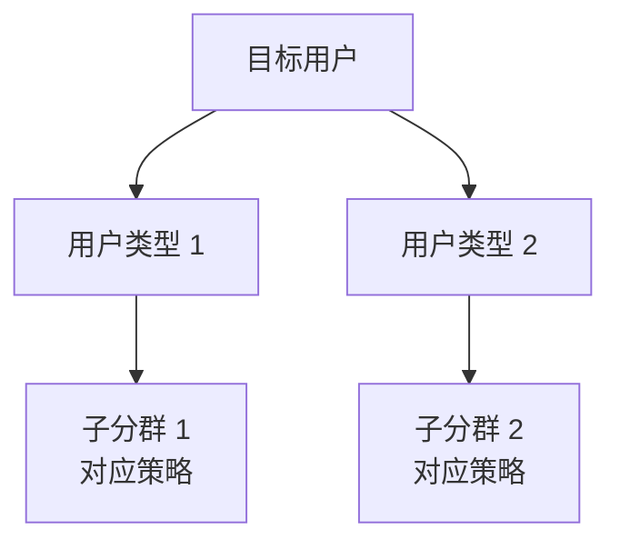
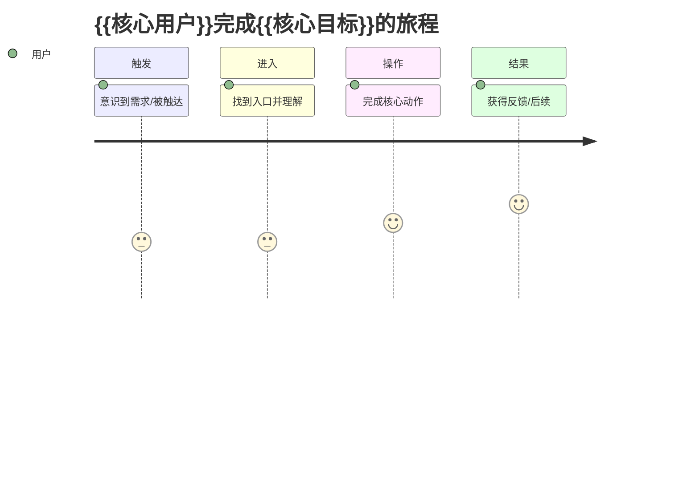
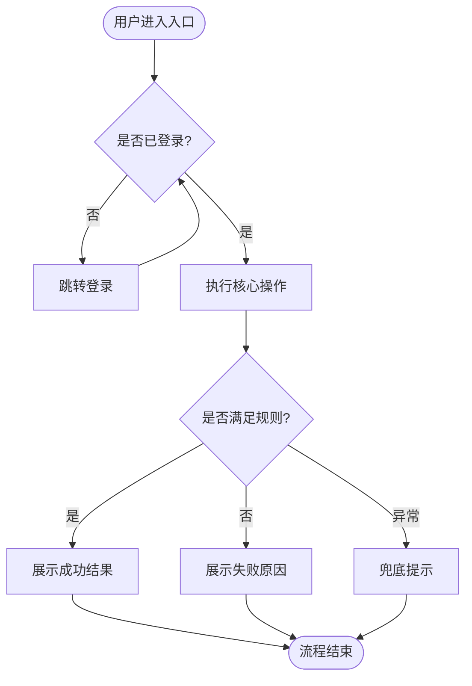
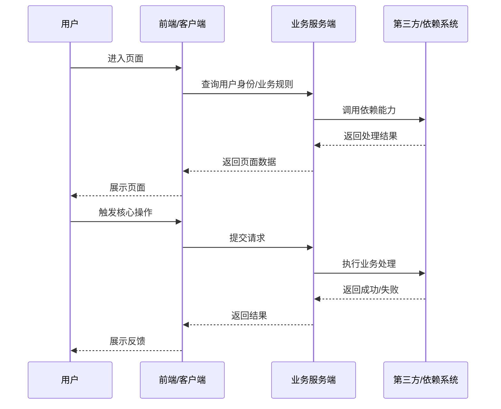
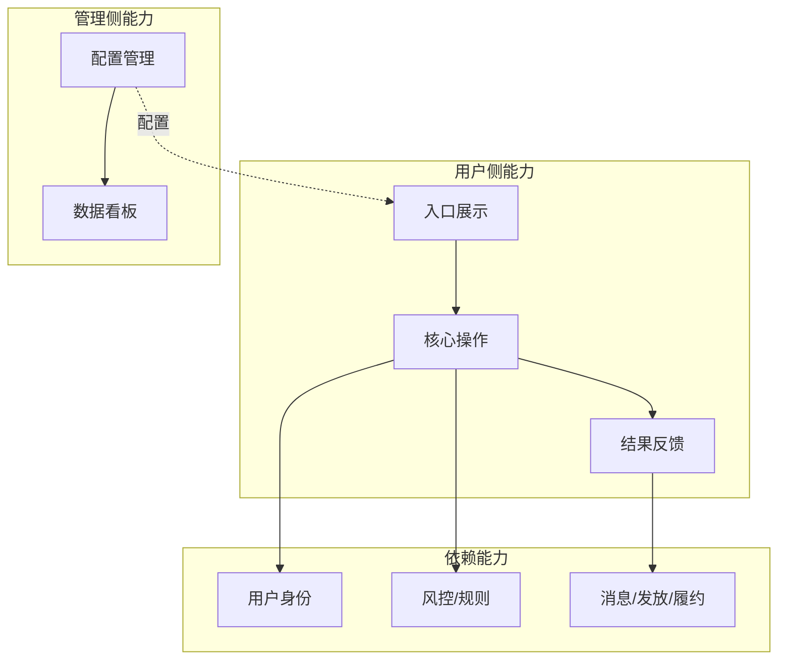
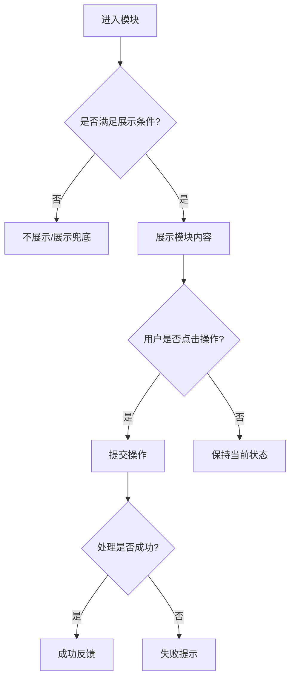

# {{产品/功能名称}} PRD

## 文档修订记录

| 版本 | 内容 | 作者 | 日期 |
| --- | --- | --- | --- |
| V0.1 | 初版 | {{作者}} | {{YYYY-MM-DD}} |

---

## 1. 概述

### 1.1 需求背景、目标及收益

**业务背景**

> 用 1-3 段说明：当前业务面临什么问题、为什么现在做、外部条件或内部约束是什么。

**项目目标**

- 拉动 {{业务/产品}} 的 {{核心指标}} 提升 {{xx%}}
- 通过 {{运营/产品/系统手段}} 触达 {{目标用户规模}}
- 在 {{周期}} 内达成 {{转化/效率/成本/满意度}} 目标

**预期收益**

| 指标 | 当前值 | 目标值 | 衡量周期 | 数据来源 |
| --- | --- | --- | --- | --- |
| {{指标 1}} | {{当前值/待确认}} | {{目标值/待确认}} | {{周期}} | {{来源}} |
| {{指标 2}} | {{当前值/待确认}} | {{目标值/待确认}} | {{周期}} | {{来源}} |

### 1.2 时间节奏

| 阶段 | 时间 | 责任方 | 产出物 |
| --- | --- | --- | --- |
| 需求评审 | {{YYYY-MM-DD}} | 产品/业务/研发/测试 | 评审结论 |
| UI/交互设计 | {{YYYY-MM-DD ~ YYYY-MM-DD}} | 设计 | 设计稿/原型 |
| 技术方案评审 | {{YYYY-MM-DD}} | 研发 | TRD/排期 |
| 研发开发 | {{YYYY-MM-DD ~ YYYY-MM-DD}} | 研发 | 可提测版本 |
| 测试/UAT | {{YYYY-MM-DD ~ YYYY-MM-DD}} | 测试/业务 | 测试报告 |
| 上线 | {{YYYY-MM-DD}} | 全员 | 上线确认 |

### 1.3 竞品分析

> 新模块、新场景必填。已有功能迭代且无直接竞品时写“无直接竞品/不涉及”，并说明原因。

| 竞品/替代方案 | 核心玩法/能力 | 优势 | 劣势 | 我们的差异化 |
| --- | --- | --- | --- | --- |
| {{竞品 A}} | {{描述}} | {{描述}} | {{描述}} | {{描述}} |

### 1.4 用户分析

| 用户名称 | 使用频率 | 用户描述 | 核心关注点 |
| --- | --- | --- | --- |
| {{用户角色 1}} | {{频率}} | {{典型场景}} | {{关注点}} |
| {{用户角色 2}} | {{频率}} | {{典型场景}} | {{关注点}} |

**用户画像**

> 每个核心角色用短句写清楚，别只列身份。

- **{{用户角色 1}}**：目标 {{他想达成什么}}；痛点 {{当前哪里难受}}；动机 {{为什么会用本功能}}。
- **{{用户角色 2}}**：目标 {{...}}；痛点 {{...}}；动机 {{...}}。

**核心场景与用户故事**

> 统一句式：作为 {{角色}}，我想要 {{能力}}，以便 {{收益}}。每个核心角色 1-3 条，覆盖主路径与关键边界场景。

- 作为 {{用户角色 1}}，我想要 {{能力}}，以便 {{收益}}。
- 作为 {{用户角色 1}}，我想要 {{能力}}，以便 {{收益}}。
- 作为 {{用户角色 2}}，我想要 {{能力}}，以便 {{收益}}。

### 1.5 指标支撑

| 产品目标 | 产品核心指标 | 支撑关系说明 |
| --- | --- | --- |
| {{目标 1}} | {{指标}} | {{为什么该功能能支撑指标}} |

---

## 2. 总体流程

### 2.1 用户图谱

> 当需求面向多类用户，且不同用户走不同链路时必填。若只有单一用户，写“不涉及多用户分群”。

### 2.2 用户旅程图

> 多触点/跨阶段体验时必填，描述用户从产生动机到完成目标（乃至后续）的完整体验链路。单步极简功能写“不涉及完整旅程”。

| 阶段 | 用户目标 | 触点/页面 | 情绪 | 痛点 | 机会点 |
| --- | --- | --- | --- | --- | --- |
| {{触发}} | {{用户想做什么}} | {{触点}} | {{正向/中性/负向}} | {{卡点}} | {{可优化点}} |
| {{进入}} | {{...}} | {{...}} | {{...}} | {{...}} | {{...}} |
| {{操作}} | {{...}} | {{...}} | {{...}} | {{...}} | {{...}} |
| {{结果}} | {{...}} | {{...}} | {{...}} | {{...}} | {{...}} |

### 2.3 业务流程图

> 描述用户从进入入口到完成核心动作的端到端流程，必须包含关键判断点与异常/兜底分支。

### 2.4 页面清单与信息架构

> 列出本需求涉及的全部页面/弹窗及其关系，作为交互设计的骨架。纯逻辑/无界面需求写“不涉及前端页面”。

| 页面/弹窗 | 入口 | 可见角色 | 核心内容 | 关联页面 |
| --- | --- | --- | --- | --- |
| {{页面 1}} | {{从哪进入}} | {{角色}} | {{该页承载什么}} | {{跳转到/来自}} |
| {{页面 2}} | {{...}} | {{...}} | {{...}} | {{...}} |

> 页面跳转较多时，补一张页面流转图（页面级跳转，区别于 2.3 的业务逻辑流程）。

### 2.5 系统交互图

> **技术区块（技术视角，供研发/测试评审，本图可用系统术语）**。涉及前端、服务端、第三方或多个内部系统协同时必填；简单纯前端文案调整可写“不涉及”。

### 2.6 涉及系统

| 涉及系统 | 支持/依赖内容 | 对接人 | 是否需改造 | 确认状态 |
| --- | --- | --- | --- | --- |
| {{系统 1}} | {{依赖内容}} | {{对接人/角色}} | {{是/否}} | {{已确认/待确认}} |

### 2.7 产品架构

> 复杂项目必填，简单功能可写“不涉及复杂产品架构”。

---

## 3. 功能需求

### 3.1 功能列表

| 功能模块 | 子功能点 | 调整类型 | 调整内容简述 | 优先级 |
| --- | --- | --- | --- | --- |
| {{模块 1}} | {{子功能}} | {{新增/优化/下线}} | {{描述}} | {{高/中/低}} |

### 3.2 {{功能模块 1}}

#### 3.2.1 用户价值与场景

> 用业务语言先讲清楚：哪些用户、在什么场景、为达成什么目标会用它；给用户/业务带来什么价值；解决了原来什么痛点。先把价值与场景说清楚，再在后续小节展开功能机制——不要一上来就堆功能点和规则。

#### 3.2.2 页面入口与展示规则

- **入口**：{{入口位置}}
- **可见条件**：{{哪些用户/状态可见}}
- **展示内容**：{{标题、说明、按钮、状态、提示}}
- **配置项**：{{哪些内容由后台/运营配置}}

#### 3.2.3 交互流程

> 这张图表达“业务逻辑流转”（满足什么条件走哪条分支）；页面级的各种状态由 3.2.4 的状态表承载，两者互补。

#### 3.2.4 页面状态与交互细则

> 交互设计的核心落点。面向用户的页面必填，逐一定义关键状态及其文案；逻辑/无界面模块写“不涉及前端交互”。

**页面状态**

| 状态 | 触发条件 | 页面表现 | 文案 |
| --- | --- | --- | --- |
| 默认态 | {{正常进入}} | {{展示什么}} | {{标题/说明}} |
| 空态 | {{无数据/未达成条件}} | {{占位/引导}} | {{空态文案与引导操作}} |
| 加载态 | {{请求中}} | {{骨架屏/loading}} | {{加载提示，必要时}} |
| 成功态 | {{操作成功}} | {{结果展示}} | {{成功 toast/页面文案}} |
| 失败态 | {{操作失败/接口异常}} | {{错误展示 + 重试入口}} | {{失败原因与下一步引导}} |
| 无权限态 | {{身份/状态不满足}} | {{拦截/降级展示}} | {{为什么不可用、如何获得权限}} |
| 异常兜底态 | {{超时/限流/库存额度不足}} | {{兜底展示}} | {{兜底文案}} |

**关键交互规则**

- **字段/输入**：{{输入约束、实时校验 vs 提交校验、错误提示文案}}。
- **反馈与防错**：{{loading 表现、toast、二次确认、防重复提交}}。
- **导航**：{{跨页跳转、返回/取消逻辑、未保存内容提示}}。

#### 3.2.5 详细规则

> 用业务语言描述规则，不用实现术语；“文案与提示”写用户真正会看到的话（如“系统繁忙，请稍后再试”，不是“接口超时降级”）。

- **正常路径**：{{用户看到什么、点击什么、系统反馈什么}}
- **判断规则**：{{身份、状态、次数、时间、权限等规则}}
- **异常兜底**：{{系统繁忙/加载失败、无权限、库存或额度不足等情况下用户看到什么}}
- **文案与提示**：{{toast、弹窗、空态、错误态}}

### 3.3 {{功能模块 2}}

> 按需复制 3.2 的结构展开。每个复杂模块都遵循“用户价值与场景 → 入口与展示 → 交互流程 → 页面状态与交互细则 → 详细规则”。

### 3.4 管理后台

> 如涉及运营配置、审核、看板、权限管理等后台能力，必须填写；不涉及则写“无后台配置需求”。

| 配置项 | 类型 | 是否必填 | 校验规则 | 备注 |
| --- | --- | --- | --- | --- |
| {{配置项}} | {{文本/单选/多选/图片/时间}} | {{是/否}} | {{规则}} | {{备注}} |

---

## 4. 非功能需求

> **技术/运营对齐区块**，可使用专业术语；但其中面向用户的文案仍需说人话。

### 4.1 联动报备

| 判断项 | 是否涉及 | 详细情况说明 | 接口人 | 共识方案 | 备注 |
| --- | --- | --- | --- | --- | --- |
| 风控 | {{是/否}} | {{说明}} | {{角色/人}} | {{方案}} | {{备注}} |
| 客服 | {{是/否}} | {{说明}} | {{角色/人}} | {{方案}} | {{备注}} |
| 财务/法务 | {{是/否}} | {{说明}} | {{角色/人}} | {{方案}} | {{备注}} |
| 合规 | {{是/否}} | {{说明}} | {{角色/人}} | {{方案}} | {{备注}} |

### 4.2 埋点方案

> 前端页面、按钮、弹窗、关键业务动作涉及数据分析时必填；不涉及则说明原因。

| 埋点位置 | 事件名 | 事件 ID | 类型 | 关键参数 |
| --- | --- | --- | --- | --- |
| {{页面/按钮}} | {{事件名}} | {{待数据团队确认}} | {{曝光/点击/提交/结果}} | {{参数}} |

### 4.3 数据上报与 BI 报表

- **前端埋点统计**：{{曝光、点击、转化等}}
- **服务端统计**：{{提交数、成功数、失败原因等}}
- **关键看板**：{{按用户分群、渠道、时间、版本拆解}}

### 4.4 性能/容量

- 预估峰值 QPS：{{待确认/数值}}
- 接口超时与降级方案：{{描述}}
- 大促/峰值场景：{{是否涉及}}

### 4.5 安全/风控

- 防刷策略：{{次数限制、设备指纹、黑名单等}}
- 敏感数据：{{脱敏、加密、权限控制}}
- 违规/异常处理：{{策略}}

---

## 5. 多期产品计划

| 期数 | 上线时间 | 迭代内容 |
| --- | --- | --- |
| 第一期 | {{YYYY-MM-DD}} | {{核心能力上线}} |
| 第二期 | {{YYYY-MM-DD/待定}} | {{扩展能力}} |

---

## 6. 未解决的问题

| 编号 | 问题描述 | 待确认方 | 期望确认时间 |
| --- | --- | --- | --- |
| 1 | {{描述}} | {{角色/团队}} | {{YYYY-MM-DD/待定}} |

---

## 7. 附录

### 7.1 参考资料

- 原始需求素材：{{链接/文档名}}
- 业务方 BRD：{{链接/文档名}}
- 关联历史 PRD：{{链接/文档名}}
- 设计稿/原型：{{链接}}

### 7.2 术语表

| 术语 | 含义 |
| --- | --- |
| {{术语}} | {{解释}} |
